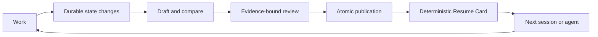

# Context Continuity

[简体中文](README.zh-CN.md) · [Quick start](#quick-start) · [Evaluation](#measured-results) · [Limits](#limits-and-trust-boundary)

**Resume long-running agent work without reconstructing the whole conversation.**

**For people running long tasks with Codex or another skill-aware agent.** Save the current goal, decisions, evidence and next step as local checkpoints, then resume after an interruption or handoff.

**Available:** [v2.1.0](https://github.com/wangyuqin378-cpu/context-continuity/releases/tag/v2.1.0) · Python 3.9+ · standard library only · [MIT](LICENSE).

**Start here:** [Install and resume a task](#quick-start) · [Complete checkpoint walkthrough](examples/quickstart/README.md).

```text
Work → checkpoint durable changes → interrupt → resume from the checkpoint
```

Local structure and recovery tests are available. A verified checkpoint means it passed the documented structure, evidence-labeling and review workflow; it does not independently prove every claim. See the [evaluation scope](#measured-results) and [trust boundary](#limits-and-trust-boundary).

## Why this exists

When a long task is compacted or handed to another agent, the dangerous loss is
not the conversation itself. It is the **current contract**:

- what the user actually wants now;
- which earlier requirements were corrected or superseded;
- what has been verified and by which source;
- which attempt already failed and should not be repeated;
- what remains blocked or uncertain;
- what must happen next, and how success will be checked.

A generic summary often sounds coherent while quietly dropping one of those
facts. Context Continuity treats them as protected task state instead of prose to
be summarized freely.

| Without Context Continuity | With Context Continuity |
|---|---|
| Re-read chat and reconstruct intent | Run one safe `resume` command |
| Guess which requirement is current | Read the explicit current contract |
| Repeat an earlier failed approach | Preserve failures that must not recur |
| Trust an unsupported status sentence | Follow evidence pointers and health |
| Start with a vague to-do list | Continue from one action and one check |

## What you get

Every published checkpoint preserves only the durable state needed to restart:

- the goal, scope, non-goals, constraints, and acceptance criteria;
- the current verified state and remaining work;
- active decisions and their rationale;
- blockers, assumptions, and unresolved questions;
- failures that would be costly or unsafe to repeat;
- evidence pointers tied to the claims they support;
- exactly one next action and one observable verification check;
- an explicit delta from the previous checkpoint.

The result is a recovery capsule, not a transcript archive.

## Quick start

### 1. Install the skill

For a user-level Codex installation:

```bash
mkdir -p ~/.codex/skills
git clone https://github.com/wangyuqin378-cpu/context-continuity.git \
  ~/.codex/skills/context-continuity
python3 ~/.codex/skills/context-continuity/scripts/contextctl.py --help
```

For another skill-aware agent, place this repository in that agent's skills
directory. The runtime requirement is Python 3.9 or later; the implementation
uses only the standard library. The local CLI workflow is covered on macOS and
Linux; end-to-end behavior in other agent hosts has not yet been validated.

Start a new Codex task, or reload the skill catalog in your host, after
installation. To update an existing installation:

```bash
git -C ~/.codex/skills/context-continuity pull --ff-only
```

If that directory is not a Git checkout, or the CLI exists only under a nested
`context-continuity/context-continuity/` directory, move the old installation to
a dated backup and clone the repository directly at the expected path. Do not
keep two writable copies and guess between them. Verify the result with:

```bash
python3 ~/.codex/skills/context-continuity/scripts/contextctl.py --version
```

Continuity files can contain goals, local paths, decisions, and evidence metadata.
Keep them out of version control unless you have reviewed them for publication:

```gitignore
**/.continuity/
```

### 2. Ask the agent to use it

Start a long-running task with a stable workspace and task ID:

```text
Use context-continuity for this task.
Task ID: webhook-retry
Workspace root: /absolute/path/to/project
Checkpoint durable state changes, not every turn.
```

The agent should first decide whether continuity is worth its overhead. It should
create a chain only for durable multi-session or high-cost recovery work, then
publish at contract changes, accepted decisions, verified phase transitions,
meaningful failures, pauses, handoffs, and completion—not after every edit or test.

### 3. Resume later

In a new session:

```text
Resume webhook-retry with context-continuity.
Use the Resume Card as the recovery entry point. Treat the published checkpoint
and cited evidence as the source of truth; do not reconstruct the task from old chat.
```

For a routine same-contract continuation, the underlying command prints the
bounded daily view:

```bash
SKILL_DIR="$HOME/.codex/skills/context-continuity"
python3 "$SKILL_DIR/scripts/contextctl.py" resume \
  /absolute/path/to/project/.continuity/webhook-retry
```

For a new agent, post-compaction recovery, contract decision, or external
mutation, request the complete cold-start view:

```bash
python3 "$SKILL_DIR/scripts/contextctl.py" resume \
  /absolute/path/to/project/.continuity/webhook-retry --full
```

A Resume Card is intentionally compact and action-oriented:

```text
READY · webhook-retry · #0007 · ACTIVE
CHECKPOINT: 0007-phase-verified.md
GOAL: Make webhook retries idempotent without changing the public API.
STATE: verified=2 · open=W004
ACTIVE IDS: decisions=D003 · blockers=B002
DO NOW: W004 — reproduce the remaining payload-hash mismatch locally.
DONE WHEN: Three fixed payloads produce the expected stable hashes.
HEALTH: source=OK · evidence OK=4 MISSING=0 EXTERNAL=0 UNSAFE=0 CHANGED=0 UNCHECKED=0
FULL CONTEXT: run `contextctl.py resume <task-dir> --full` before a cold handoff,
contract decision, or external mutation.
```

## The mental model



**Checkpoint durable changes, not every turn.** The Markdown chain is the source
of truth; the Resume Card is a read-only projection optimized for recovery.

## When to use it

Context Continuity is a good fit when:

- work spans multiple sessions, days, or context compactions;
- several agents or people will hand work to one another;
- scope, permissions, and acceptance criteria must remain exact;
- repeating a failed attempt is expensive or unsafe;
- decisions need rationale and evidence, not just a final answer;
- the task must be paused and resumed without relying on chat memory.

It is usually the wrong tool when:

- the task will finish in a few minutes;
- the work is disposable brainstorming;
- there is no stable writable workspace;
- the material would require putting secrets into checkpoints;
- the overhead of review is larger than the cost of restarting.

## How it protects continuity

### Append-only, hash-linked history

The compliant workflow never edits or deletes a published checkpoint; any such
mutation makes a later audit fail. Each checkpoint points to its predecessor and
records an explicit delta, so current state cannot silently erase an earlier
correction or unresolved conflict.

### Comparison and compaction at every durable transition

Later checkpoints are compared with the previous published state. Completed
detail and repeated logs are replaced by evidence pointers; active contracts,
decisions, blockers, failures, and verification conditions remain protected.

Large initial sources have a 30% hard reduction gate in both words and UTF-8
bytes, with a 40% authoring target. The objective is higher information density,
not shorter text at any cost.

### Evidence-bound review

A review is bound to the exact candidate bytes, task root, source, local evidence,
protected IDs, next action, and verification check. File reachability and semantic
support are separate gates: an existing file is not automatically proof of a
claim.

### Atomic publication

Checkpoint, review sidecar, and required marker are committed under one writer
lock. Failed or concurrent publication leaves the previously published state
intact.

### Monotonic completion

Ordinary work cannot reopen a completed chain. A completed task only permits a
bounded post-commit receipt or evidence repair that remains complete; new scope
starts a new task chain.

## Measured results

The accepted V2 implementation produced these results in the repository's frozen
evaluation protocol:

| Measure | Baseline | Accepted V2 |
|---|---:|---:|
| Resume path | Multiple commands and manual reading | One command |
| Full cold-recovery view | About 77 lines | 22–23 lines |
| First-pass cold recovery | 0/3 | 3/3 |
| Protected-fact recall | 92.3% | 100% |
| Feedback cycles across three readers | 5 | 0 |
| Deterministic regression suite | — | 127/127 |
| Internal terminal attack matrix | — | 91/91 |

Read the [public evaluation report](docs/EVALUATION.md) for the protocol, failed
attempts, reproducible checks, frozen empirical results, and exact claim boundary.
The [evaluation README](evals/README.md) explains how the recovery benchmark is
scored.

V2.1 adds a deterministic daily view capped at 12 lines; the frozen cold-reader
results above continue to apply to `resume --full`, not to the new brief view.

The deterministic suite is publicly reproducible. The model-reader and 91-case numbers
are frozen internal development results, not a third-party audit; original model
and sampling metadata were not fully frozen. They provide bounded evidence, not
universal reliability across every model, host, or production workload.

## Operator commands

Most users should let the agent follow [`SKILL.md`](SKILL.md). For operators and
integrators, the CLI exposes the full state machine:

```text
resume        Audit the chain and render a bounded daily card (`--full` for cold start)
draft         Create one exclusive candidate checkpoint
complete      Create a validated terminal candidate
review-init   Bind a fresh review manifest
review-check  Validate the completed review
publish       Atomically publish a reviewed candidate
doctor        Diagnose chain and working state
unlock        Remove a provably stale same-host writer lock
list-tasks    Discover continuity tasks under a workspace
```

Run `python3 scripts/contextctl.py --help` for syntax. The canonical workflow and
failure handling live in [`SKILL.md`](SKILL.md); the checkpoint schema and
compaction rules live under [`references/`](references/).
See the [quick-start walkthrough](examples/quickstart/README.md) for a prompt-led
example and the [architecture note](docs/ARCHITECTURE.md) for implementation
invariants.

## Limits and trust boundary

Context Continuity is intentionally explicit about what it cannot guarantee:

- Without host lifecycle hooks, activation and pre-compaction capture are
  best-effort. A plain skill cannot intercept every crash or uninvoked session.
- Local hashes establish integrity and workflow provenance, not authorship
  against a malicious process with the same filesystem permissions.
- External evidence still requires a reviewer to judge semantic support.
- Synthetic fixtures and small separate-reader sets do not represent every
  model or real-world task.
- GUI integration, network services, global host hooks, and model-wide claims are
  outside the current release boundary.

Do not put credentials, tokens, private keys, raw hidden reasoning, or unnecessary
personal data into checkpoints.

## Repository map

```text
SKILL.md          Agent-facing workflow and activation rules
scripts/          Validation, review, publication, recovery, and diagnosis
references/       Checkpoint schema and compaction gate
tests/            Deterministic, adversarial, and recovery regression tests
evals/            Reproducible fixture, protocol, and scorer
examples/         Prompt-led first-run walkthrough
docs/             Public evaluation report and architecture notes
```

## Development

Run the full standard-library test suite:

```bash
python3 -m unittest discover -s tests -p 'test_*.py'
python3 -m py_compile scripts/checkpoint_guard.py scripts/contextctl.py
```

Protocol changes should include a regression test and update the relevant user or
operator documentation. See [CONTRIBUTING.md](CONTRIBUTING.md) and
[SECURITY.md](SECURITY.md).

## Release status

**V2.1 lean release:** preserves the V2 bounded integrity and cold-recovery path,
while adding the brief daily projection, activation gate, and safer moved-root
diagnostics. The frozen model-reader claims apply to `resume --full`; V2.1 does
not claim that the brief view replaces a full cold handoff.

## License

[MIT](LICENSE)
