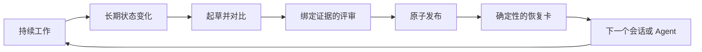

# Context Continuity

[English](README.md) · [快速开始](#快速开始) · [评测结果](#评测结果) · [能力边界](#能力边界与信任边界)

**不必重读整段对话，也能可靠续跑一个长期 Agent 任务。**

[](https://github.com/wangyuqin378-cpu/context-continuity/actions/workflows/test.yml)


[](LICENSE)

Context Continuity 会把任务中真正需要长期保留的变化，整理成精简、经过验证、
只追加不覆盖的 Markdown 检查点。当上下文被压缩、会话被中断或任务交给另一个
Agent 时，可以用有边界的日常卡继续执行，也可以在冷启动时读取完整、确定性的
契约与证据视图。

这里的“经过验证”是指检查点通过了文档规定的本地结构检查、证据标注与评审流程，
不代表每个事实都已经获得普遍或独立的真实性证明。

> 它不是更大的上下文窗口，而是一种更可靠的继续方式。

## 为什么需要它

一个长期任务在压缩或交接时，最危险的不是丢掉聊天原文，而是丢掉**当前契约**：

- 用户现在真正要什么；
- 哪些旧要求已经被纠正或替代；
- 哪些结论已经验证、由什么证据支撑；
- 哪条路已经失败，不应该再走一次；
- 当前还有什么阻塞或不确定性；
- 下一步究竟做什么，以及如何判断它完成。

普通摘要即使读起来很连贯，也可能悄悄漏掉其中一项。Context Continuity
把这些内容当作受保护的任务状态，而不是可以自由改写的一段叙述。

| 没有 Context Continuity | 使用 Context Continuity |
|---|---|
| 重读聊天并重新推断意图 | 一次 `resume` 得到恢复卡 |
| 猜测哪个需求才是当前版本 | 直接读取明确的当前契约 |
| 重复已经失败过的方案 | 保留不能再重复的失败 |
| 相信没有依据的状态描述 | 检查证据指针和健康状态 |
| 从模糊的待办列表开始 | 从唯一下一步和验证条件继续 |

## 最终会得到什么

每个正式发布的检查点，只保留重新启动任务所需的长期状态：

- 目标、范围、非目标、约束与验收标准；
- 当前已经验证的状态和剩余工作；
- 生效中的决策及其理由；
- 阻塞、假设和未解决问题；
- 代价较高或危险、不能重复的失败；
- 与结论绑定的证据位置；
- 唯一下一步和一个可观察的验证条件；
- 相比上一个检查点发生了哪些变化。

它生成的是“恢复胶囊”，不是聊天记录仓库。

## 快速开始

### 1. 安装 Skill

安装到 Codex 用户级 Skill 目录：

```bash
mkdir -p ~/.codex/skills
git clone https://github.com/wangyuqin378-cpu/context-continuity.git \
  ~/.codex/skills/context-continuity
python3 ~/.codex/skills/context-continuity/scripts/contextctl.py --help
```

如果使用其他支持 Skill 的 Agent，把本仓库放到对应的 Skill 目录即可。运行环境
需要 Python 3.9 或更高版本，代码只使用 Python 标准库。本地 CLI 流程已经覆盖
macOS 与 Linux；其他 Agent 宿主中的端到端行为尚未逐一验证。

安装后请新建一个 Codex 任务，或者让当前宿主重新加载 Skill 列表。更新已有安装：

```bash
git -C ~/.codex/skills/context-continuity pull --ff-only
```

如果该目录不是 Git checkout，或者 CLI 只存在于重复嵌套的
`context-continuity/context-continuity/` 中，请先把旧安装移动到带日期的备份目录，
再把仓库直接克隆到预期路径。不要保留两个可写副本后靠猜测选择。完成后验证：

```bash
python3 ~/.codex/skills/context-continuity/scripts/contextctl.py --version
```

连续性文件可能包含目标、本地路径、决策和证据元数据。除非已经完成发布前审查，
否则应把它们排除在版本控制之外：

```gitignore
**/.continuity/
```

### 2. 告诉 Agent 使用它

启动一个长期任务时，给出稳定的工作区和任务 ID：

```text
这个任务使用 context-continuity。
任务 ID：webhook-retry
工作区根目录：/absolute/path/to/project
只在长期状态发生变化时建立检查点，不要每轮都建立。
```

Agent 应先判断 continuity 的收益是否高于维护成本。只有长期、多会话或恢复代价
高的任务才创建链；此后仅在契约变化、决策确认、阶段完成、重要失败、暂停、交接
和最终完成时发布，不在每次改文件或跑测试后建立检查点。

### 3. 在新会话里恢复

```text
使用 context-continuity 恢复 webhook-retry。
把 Resume Card 作为恢复入口；正式发布的 checkpoint 和引用证据仍是事实来源。
不要根据旧聊天重新拼接任务。
```

日常在同一契约下继续时，默认命令输出有边界的精简卡：

```bash
SKILL_DIR="$HOME/.codex/skills/context-continuity"
python3 "$SKILL_DIR/scripts/contextctl.py" resume \
  /absolute/path/to/project/.continuity/webhook-retry
```

新 Agent、压缩后恢复、契约决策或外部变更前，读取完整冷启动视图：

```bash
python3 "$SKILL_DIR/scripts/contextctl.py" resume \
  /absolute/path/to/project/.continuity/webhook-retry --full
```

恢复卡会刻意保持精简，并直接指向行动：

```text
READY · webhook-retry · #0007 · ACTIVE
CHECKPOINT: 0007-phase-verified.md
GOAL: 在不改变公开 API 的前提下，让 webhook 重试具备幂等性。
STATE: verified=2 · open=W004
ACTIVE IDS: decisions=D003 · blockers=B002
DO NOW: W004 — 在本地复现剩余的 payload hash 不一致。
DONE WHEN: 三个固定 payload 都得到预期的稳定 hash。
HEALTH: source=OK · evidence OK=4 MISSING=0 EXTERNAL=0 UNSAFE=0 CHANGED=0 UNCHECKED=0
FULL CONTEXT: 冷启动交接、契约决策或外部变更前运行
`contextctl.py resume <task-dir> --full`。
```

## 工作原理



**记录长期变化，而不是记录每一轮对话。** Markdown 检查点链是事实来源，
Resume Card 是为了快速恢复而生成的只读视图。

## 什么时候值得使用

适合以下任务：

- 跨越多个会话、几天时间或多次上下文压缩；
- 多个 Agent 或多人之间需要交接；
- 范围、权限和验收标准不能被模糊处理；
- 重复一次失败方案的代价很高；
- 决策需要理由与证据，而不仅是一个最终答案；
- 任务需要暂停后继续，不能只依赖聊天记忆。

通常不适合以下任务：

- 几分钟就能完成的一次性工作；
- 随时可以丢弃的头脑风暴；
- 没有稳定、可写工作目录；
- 必须把密钥写进检查点才能工作；
- 建立和评审检查点的成本高于重新开始。

## 它如何保护连续性

### 只追加、哈希相连的历史

合规流程不会编辑或删除正式发布的检查点；发生此类修改后，后续审计会失败。
每一个检查点都指向前一个版本，并明确记录变化，因此当前状态不能悄悄抹去之前
的用户纠正或未解决冲突。

### 每次长期变化都要对比和压缩

后续检查点必须与上一个正式版本比较。已完成的过程和重复日志会压缩成证据指针，
但当前契约、决策、阻塞、失败与验收条件会继续保留。

较大的初始来源必须同时在单词数和 UTF-8 字节数上至少缩减 30%，写作目标是
40%。追求的是更高的信息密度，而不是不顾信息损失地缩短文字。

### 与证据绑定的评审

评审会绑定候选文件的精确内容、任务目录、来源、本地证据、受保护 ID、下一步和
验证条件。文件“存在”与文件“真的支持这个结论”是两个不同的检查项。

### 原子发布

检查点、评审记录和必要标记会在单写入者锁下作为一次事务提交。发布失败或发生
并发冲突时，上一个正式状态仍保持完整。

### 完成状态不可随意重开

普通工作不能重新打开已经完成的任务链。完成后的链只允许受限的提交回执或证据
修复，而且仍必须保持完成；出现新范围时，应创建新的任务链。

## 评测结果

在仓库冻结的评测协议下，V2 最终版本取得了以下结果：

| 指标 | 基线 | V2 最终结果 |
|---|---:|---:|
| 恢复路径 | 多条命令并手动阅读 | 一条命令 |
| 完整冷启动视图 | 约 77 行 | 22–23 行 |
| 第一次冷恢复成功率 | 0/3 | 3/3 |
| 受保护事实召回率 | 92.3% | 100% |
| 三名读者所需反馈轮数 | 5 | 0 |
| 确定性回归测试 | — | 127/127 |
| 内部终态攻击矩阵 | — | 91/91 |

[公开评测报告](docs/EVALUATION.md)包含评测协议、失败尝试、可复现检查、冻结的
经验结果和准确声明边界；[评测说明](evals/README.md)解释了恢复效果如何计分。

V2.1 新增了最多 12 行的确定性日常视图；上面的冻结冷启动读者结果继续对应
`resume --full`，不用于宣称新的精简视图已经完成同等模型评测。

确定性测试可以在公开仓库复现；模型读者与 91 项攻击矩阵属于冻结的内部
开发结果，不是第三方审计，原始模型和采样参数也没有被完整冻结。这些数据提供
有边界的证据，但不能证明工具适用于所有模型、宿主环境和真实任务。

## 面向操作者的命令

大多数使用者只需要让 Agent 遵循 [`SKILL.md`](SKILL.md)。如果需要集成或调试，
CLI 提供完整状态机：

```text
resume        审计任务链并生成日常精简卡（冷启动使用 `--full`）
draft         独占创建一个候选检查点
complete      创建经过终态校验的完成候选
review-init   创建并绑定新的评审清单
review-check  校验已经填写的评审
publish       原子发布经过评审的候选检查点
doctor        诊断任务链和工作状态
unlock        移除能够证明已经失效的同主机写入锁
list-tasks    查看工作区内的连续性任务
```

运行 `python3 scripts/contextctl.py --help` 查看参数。标准流程和错误处理位于
[`SKILL.md`](SKILL.md)，检查点结构与压缩规则位于 [`references/`](references/)。
[快速上手示例](examples/quickstart/README.md)提供了一条以提示词为主的首次使用
路径，[架构说明](docs/ARCHITECTURE.md)解释了实现不变量。

## 能力边界与信任边界

Context Continuity 会明确说明自己不能保证什么：

- 没有宿主生命周期钩子时，启用 Skill 和压缩前保存只能尽力而为；普通 Skill
  无法拦截每一次崩溃或没有调用它的新会话。
- 本地哈希可以证明完整性和流程来源，但不能对抗拥有相同文件权限的恶意进程，
  也不能证明“谁”完成了评审。
- 外部证据是否真的支持结论，仍需要评审者进行语义判断。
- 合成夹具和少量独立读者不能代表所有模型与生产任务。
- GUI、网络服务、全局宿主钩子和跨模型普适性不在当前版本范围内。

不要把凭证、Token、私钥、原始隐藏推理或不必要的个人信息写入检查点。

## 仓库结构

```text
SKILL.md          Agent 的工作流程和触发规则
scripts/          校验、评审、发布、恢复与诊断
references/       检查点结构和压缩门槛
tests/            确定性、对抗性和恢复回归测试
evals/            可复现夹具、协议和计分器
examples/         以提示词为主的首次使用示例
docs/             公开评测报告和架构说明
```

## 开发与验证

运行完整的标准库测试：

```bash
python3 -m unittest discover -s tests -p 'test_*.py'
python3 -m py_compile scripts/checkpoint_guard.py scripts/contextctl.py
```

任何协议变化都应该同时增加回归测试，并更新对应的用户或操作者文档。详见
[CONTRIBUTING.md](CONTRIBUTING.md) 和 [SECURITY.md](SECURITY.md)。

## 发布状态

**V2.1 lean release：** 保留 V2 bounded 的完整性与冷启动路径，同时增加日常精简
视图、启用门槛和更安全的搬家诊断。冻结的模型读者结论只对应 `resume --full`；
V2.1 不声称精简视图可以替代完整冷交接。

## 许可证

[MIT](LICENSE)
