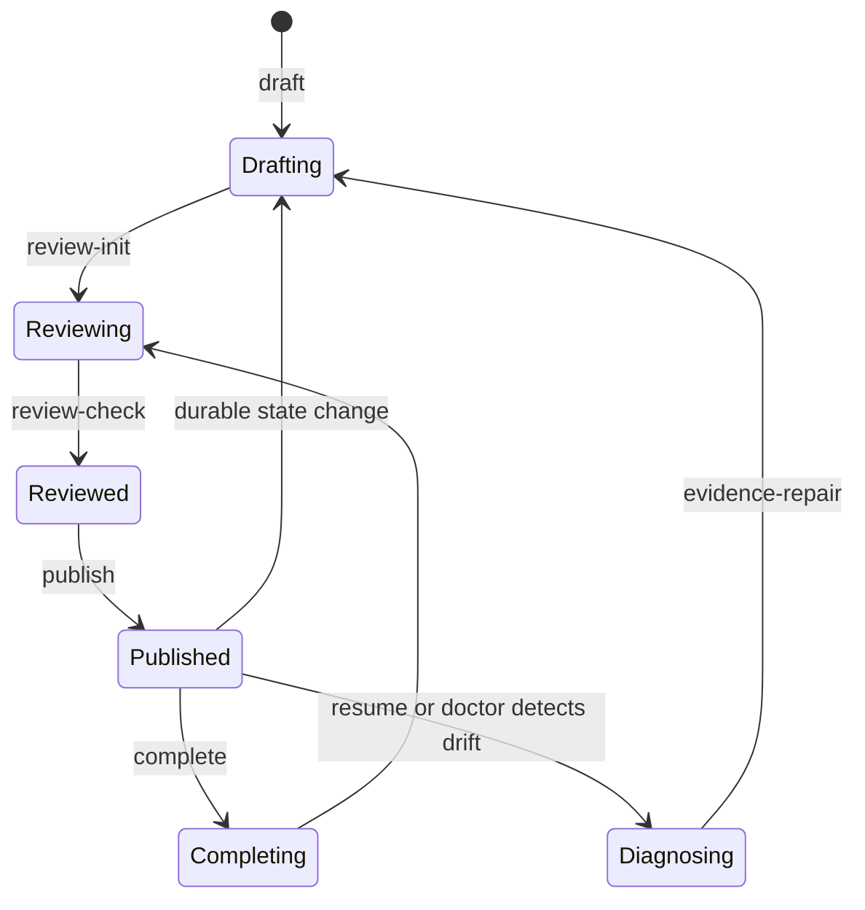

# Architecture

Context Continuity is deliberately file-based. The core product decision is that
the restartable state of a task should remain inspectable without a database,
network service, or proprietary runtime.

## Components

| Component | Responsibility |
|---|---|
| `SKILL.md` | Tells an agent when to checkpoint, resume, repair, and finish |
| `scripts/contextctl.py` | Provides the low-friction operator state machine and actionable errors |
| `scripts/checkpoint_guard.py` | Parses checkpoints and enforces continuity, evidence, transition, and publication invariants |
| `references/checkpoint-format.md` | Defines canonical state, stable IDs, evidence rules, and terminal structure |
| `references/compaction-gate.md` | Defines comparison, retention, compression, cold-start rehearsal, and publish safety |

## On-disk model

Each task owns one append-only chain:

```text
<workspace>/.continuity/<task-id>/
├── candidate.md
├── review.json
├── checkpoints/
│   ├── 0001-init.md
│   └── 0002-phase-verified.md
├── reviews/
│   ├── 0001-init.json
│   └── 0002-phase-verified.json
└── required/
    ├── 0001-init.required.json
    └── 0002-phase-verified.required.json
```

The largest continuous sequence is authoritative. Modification time is never used
to decide which checkpoint is latest.

## Publication lifecycle



`publish` revalidates the candidate and current chain under one writer lock. The
review sidecar and required marker are linked before the checkpoint; the
checkpoint is the commit point and is linked last. A pre-commit failure removes
new companions and leaves the previous latest checkpoint unchanged.

## Stable identity model

Durable facts use stable IDs:

```text
G goal        I in-scope       O out-of-scope
S success     C constraint     D decision
W work        E evidence       B blocker
F failure     A assumption or unknown
```

An ID cannot silently change meaning. Contract changes allocate new IDs and cite
authorization. Removed facts require a structured successor, resolution, or
compression transition in the delta.

## Evidence model

The system separates two questions:

1. **Can the machine safely resolve the pointer?**
2. **Does the cited content actually support the claim?**

The first produces `OK`, `EXTERNAL`, `MISSING`, or `UNSAFE`. The second is a fresh
reviewer's `DIRECT`, `REPORTED`, or `UNSUPPORTED` judgment. Publication requires
both gates to be satisfied; `EXTERNAL` never means “verified.”

## Protected invariants

- Checkpoint history is append-only, continuous, and hash-linked.
- Contract meaning changes only through an authorized contract checkpoint.
- Protected facts cannot disappear without an explicit delta transition.
- One checkpoint contains one next action and one observable verification check.
- Candidate mutation invalidates its review.
- Failed or concurrent publication preserves the previous latest state.
- Completion is monotonic; ordinary work cannot reopen a completed chain.
- Resume is a projection of canonical state, never a rewritten summary.

## Trust boundary

The architecture provides local integrity and workflow provenance. It does not
authenticate authorship against an attacker with the same filesystem permissions,
make external evidence semantically true, or guarantee that a host invokes the
skill before every interruption. Those limits are product boundaries, not hidden
implementation details.
